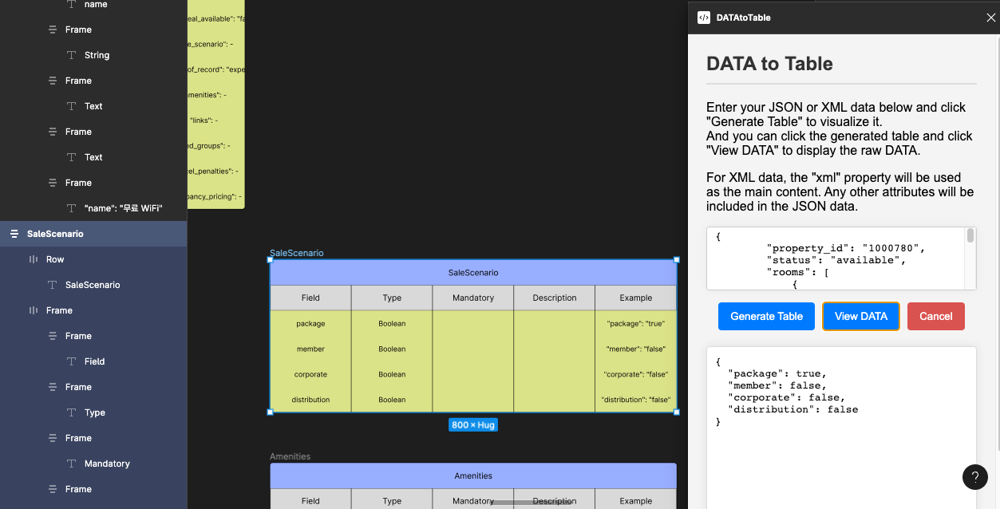
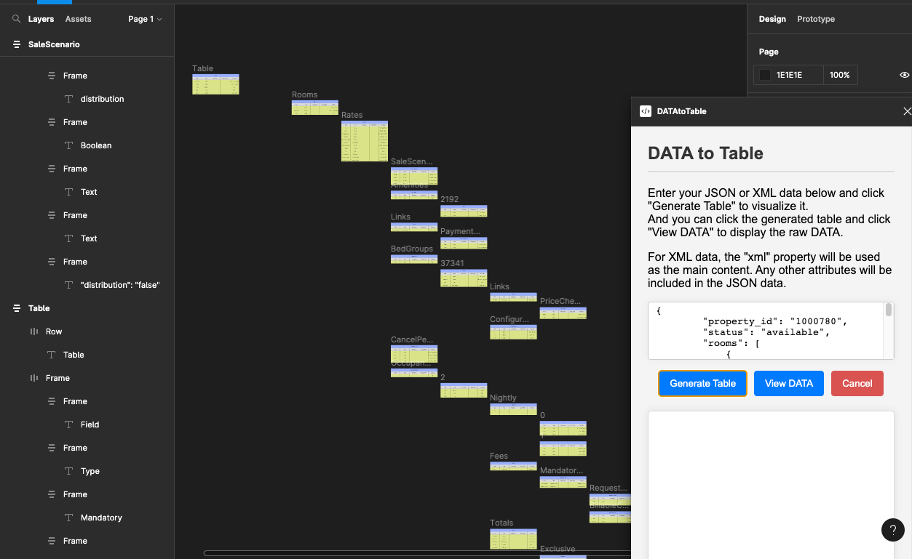

#  Figma Data to Table Plugin 

---

The [Figma Data to Table Plugin](https://www.figma.com/community/plugin/1286190234862067264) is designed to streamline the workflow of designers and developers 

by allowing them to visualize and analyze JSON and XML data directly within the Figma interface. 

With this plugin, you can easily convert structured data into organized tables, 

making it convenient for front-end (F) and back-end (B) developers to collaborate effectively on projects.

and back-end (B) developers to analyze and work with data directly within Figma.

---

## Key Features

- **Data Visualization**
  - Input your JSON or XML data, and the plugin will generate a structured table within Figma, providing a visual representation of your data.
  - Child Objects are created in a separate table positioned at the bottom right of their parent Object. 
  - This allows for an intuitive representation of nested data structures.
  - Sibling Objects are created at the same depth, visually representing data structures at the same hierarchical level.
  - This makes it easy for designers to incorporate data-driven elements into their designs.
- 

 

- **Data Analysis**
  - Developers (B-E) can utilize the generated tables to analyze and understand the underlying data structure. 
  - This feature simplifies the process of extracting key information from complex data sets.

 

- **Source Data View**
  - Clicking on the generated table allows you to access the raw source data directly within Figma. 
  - This makes it effortless for developers to inspect and work with JSON, XML, and other data formats, 
  - enhancing collaboration between design and development teams.
  - 
    
---

## How It Works

1. Input Data
   1. Simply paste your JSON or XML data into the plugin's input field.

2. Generate Tables
   1. Click the "Generate Table" button, and the plugin will create a structured table based on your data.

3. Data Analysis
   1. Developers can use the generated table to quickly understand the data structure and extract relevant information.

4. Source Data View
   1. Click the table and use the "View Data" feature to access the raw source data, making it easier to work with the data directly in Figma.

---

## Collaboration Made Easy

The Figma `Data to Table` Plugin bridges the gap between design and development by providing a seamless way to visualize, analyze, and work with data. 

It empowers designers to incorporate real data into their designs and enables developers to gain insights from the design files. 

This collaborative approach enhances the overall project workflow and communication between design and development teams.

---

## Feedback and Support

If you have any questions, encounter issues, or wish to provide feedback or suggestions for improvements,

please feel free to reach out to us via email at [swgil007@naver.com](mailto:swgil007@naver.com) or [Figma Data to Table Plugin Page Comments](https://www.figma.com/community/plugin/1286190234862067264)

Your input is valuable and greatly appreciated as it helps us enhance the Figma `Data to Table` Plugin.
